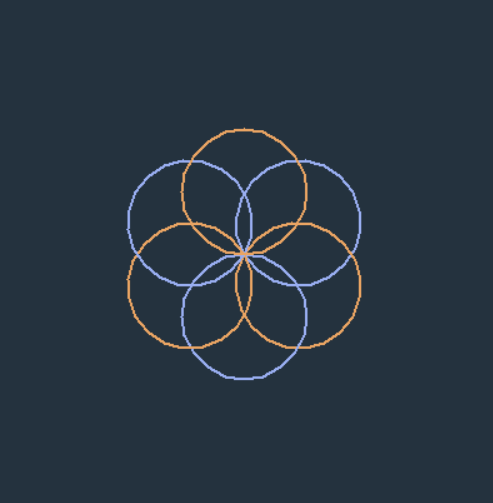
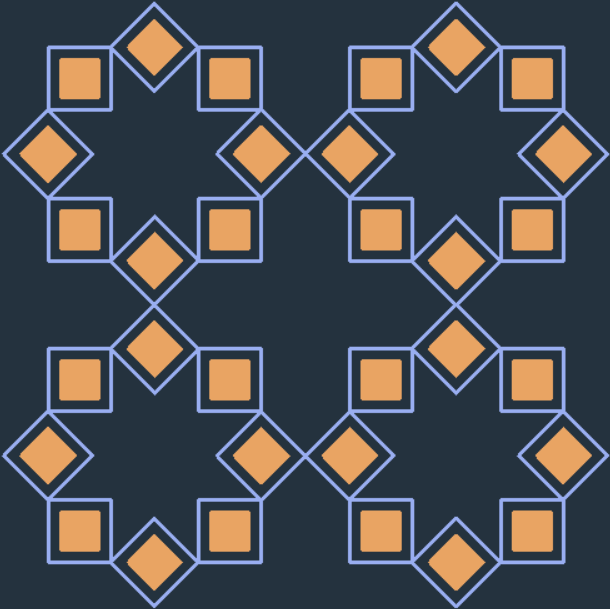

# Python Turtle Drawings 🐢

This repo contains some of my projects that I made while learning Python by using the turtle module. The turtle module is a fun way of drawing shapes and patterns with a virtual turtle that moves and turns on the screen.

## How to run the projects 🚀

To run the projects, you need to have Python installed on your computer. You can download it from [here](https://www.python.org/downloads/).

Then, you can clone this repo or download it as a zip file. Open the folder where you saved the repo and navigate to the project you want to run. For example, if you want to run the hexagon.py project, you can type this in your terminal:

```bash
cd python-turtle-drawings
python octastar.py
```

This will open a new window where you can see the turtle drawing the hexagon. You can close the window by clicking on the X button or by pressing Ctrl+C in your terminal.

## List of projects 📜

Here are some of the projects I made with the turtle module:

### circular_rosette.py
Circular rosette with 6 petals. It is made by rotating circles about a fixed point.



### octastar.py

Draws octastars using small squares of diffrent colors.


### octastar2.py

Draws octastars using one line.


## Resources 📚

To learn more about turtle module, check these resources:

- [Python Turtle Documentation](https://docs.python.org/3/library/turtle.html)
- [Python Turtle Tutorial](https://realpython.com/beginners-guide-python-turtle/)
- [Python Turtle Graphics](https://www.geeksforgeeks.org/turtle-programming-python/)

## Feedback and suggestions 💬

I hope you enjoy my projects and find them useful for learning Python. If you have any feedback or suggestions, feel free to contact me via [linkedin](https://www.linkedin.com/in/al-waleed-ibrahim/)